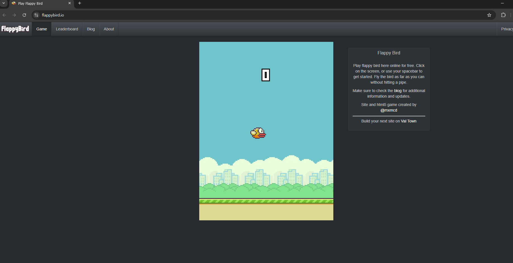
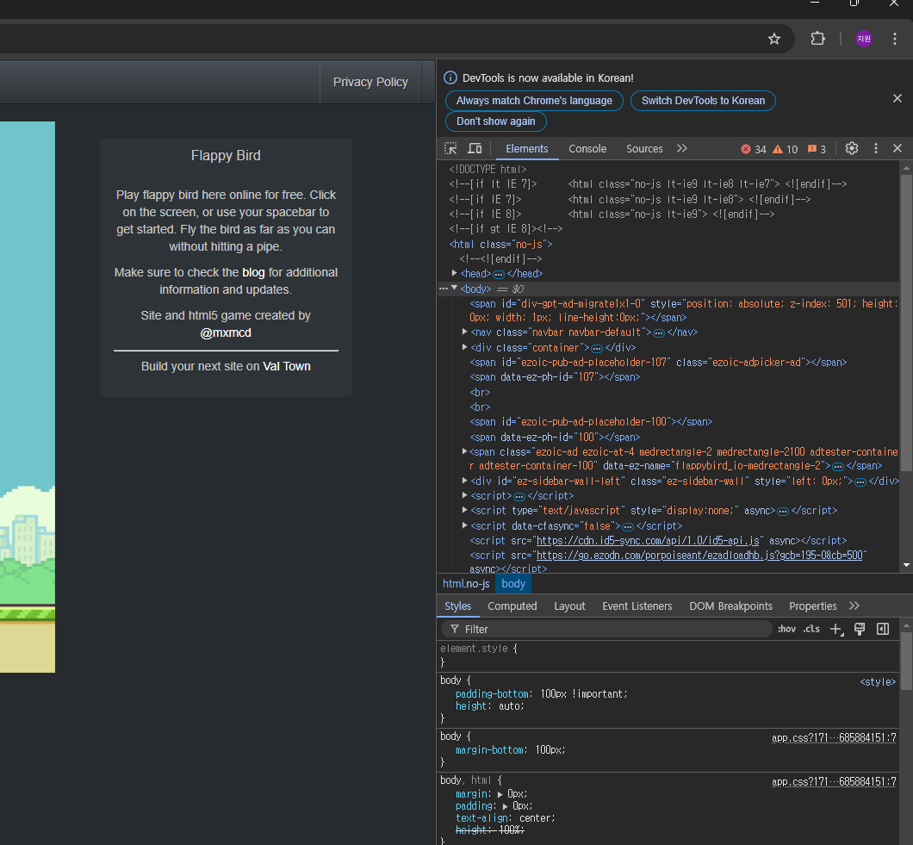
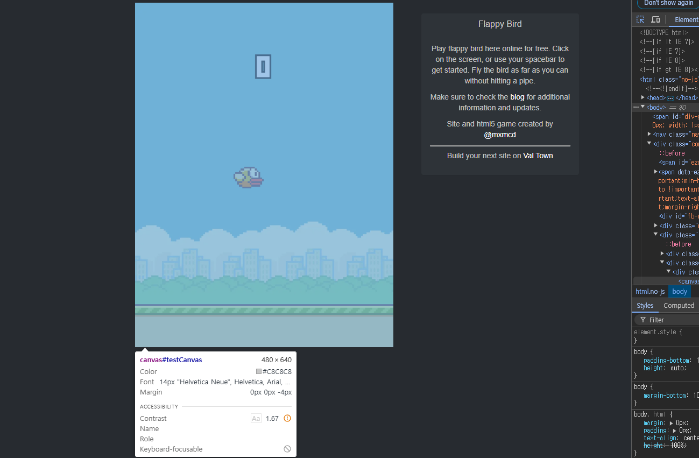

# FlappyBird 게임 플레이 영역의 가로-세로 크기 조사

이 문서는 FlappyBird 게임 플레이 영역의 가로-세로 크기를 조사한 방법 및 결과에 대한 문서입니다.

## FlappyBird 게임 접속

구글 크롬을 이용해서 [다음 링크](https://flappybird.io/)에 접속하고 FlappyBird 게임을 시작합니다.

## 크기 조사하기

`F12` 키를 입력하면 개발자 도구를 활성화 할 수 있습니다.

아래의 빨간색 상자 표시에 있는 개발자도구 창 왼쪽 상단을 클릭합니다.

클릭하면 웹페이지 내의 HTML 요소를 확인할 수 있습니다.

위 HTML 요소에서 확인할 결과, 가로x세로 크기는 480x640 입니다. 다른 Flappy Bird를 확인해봐도 대체로 비슷한 비율입니다. 